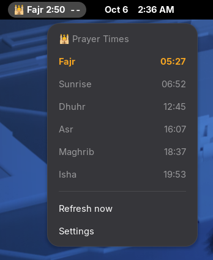
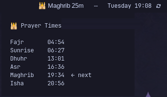
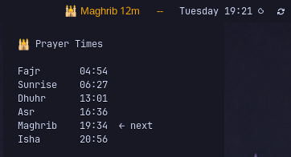
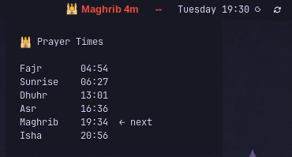
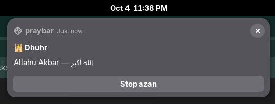
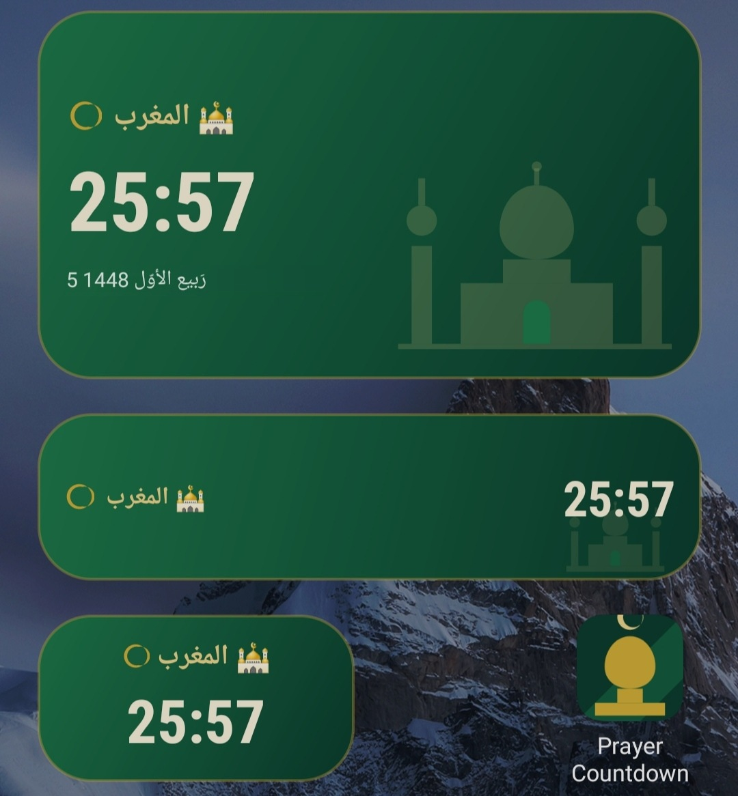
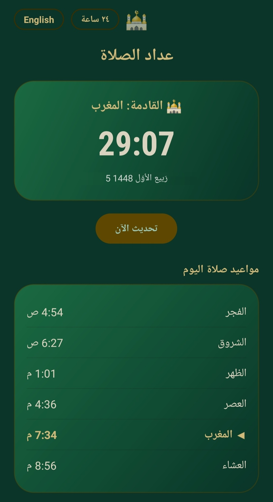

<div align="center">


### *A live countdown to the next prayer — in your Linux bar, your GNOME top bar and on your phone's home screen.*



*The GNOME extension: countdown right next to the clock, the whole day one click away.*

[](#-pick-your-platform)
[](android/README.md)
[](LICENSE)
[](https://github.com/diea-abdeltwab)

[](https://git.io/typing-svg)

</div>

---

## 🕋 About

**praybar** is a small family of prayer-time tools built around one idea: **a live countdown to the next prayer, exactly where you already look** — with a full daily schedule and azan playback, and nothing to configure.

You never type in a city or coordinates. Every version detects where you are, and **re-detects it once a day** (at 00:00 on Linux) together with the new day's timings, so travelling to another city just works.

---

## 🧭 Pick your platform

| I use… | Use this | What you get | Docs |
|---|---|---|---|
| 🐧 **GNOME** (Fedora, Ubuntu, …) | [`gnome/`](gnome/) | Native Shell extension: countdown next to the clock, schedule dropdown, notification with a **Stop azan** button, preferences window | [`gnome/README.md`](gnome/README.md) |
| 🐧 **Waybar** (Hyprland, Sway, Omarchy 3, …) | [`hyprland/`](hyprland/) | Waybar module: countdown in the bar, tooltip with the schedule, notifications and azan | [`hyprland/README.md`](hyprland/README.md) |
| 🐧 **Omarchy 4 "Quattro"** | [`omarchy-quatto/`](omarchy-quatto/) | The same module ported to Quattro's Quickshell bar via a `shell.json` command module | [`omarchy-quatto/README.md`](omarchy-quatto/README.md) |
| 📱 **Android** | [`android/`](android/) | Home-screen widget (3 sizes) + app, scheduled azan alarms | [`android/README.md`](android/README.md) |

> 🔎 **Not sure which Linux folder?** `~/.config/omarchy/shell.json` exists → Quattro (`omarchy-quatto/`). `~/.config/waybar/config.jsonc` exists → `linux/`. Running the GNOME desktop → `gnome/`.

---

## 📸 Preview

<div align="center">

| Normal | Getting close (< 15 min) | Imminent (< 5 min) |
|:---:|:---:|:---:|
|  |  |  |
| Waybar tooltip with the full schedule | Text turns amber | Text turns red |

| GNOME notification | Android widgets | Android app |
|:---:|:---:|:---:|
|  |  |  |
| Persistent, with a one-click *Stop azan* | All three widget sizes | Today's schedule + countdown |

</div>

---

## ✨ At a glance

| | GNOME | Waybar | Quickshell | Android |
|---|:---:|:---:|:---:|:---:|
| Live countdown | ✅ next to the clock | ✅ in the bar | ✅ in the bar | ✅ widget + app |
| Full daily schedule | ✅ dropdown | ✅ tooltip | ✅ tooltip | ✅ app |
| Colour urgency (amber → red) | ✅ | ✅ | ✅ | ✅ gradient |
| Notification | ✅ with **Stop azan** | ✅ dismissible | ✅ dismissible | ✅ with stop action |
| Azan playback | ✅ | ✅ | ✅ | ✅ scheduled alarm |
| Settings UI | ✅ native window | edit a constant | edit a constant | in-app |
| Location | 🧭 GeoClue → wttr.in → IP | 🧭 wttr.in → IP | 🧭 wttr.in → IP | 🧭 IP-based |
| Location re-detected daily | ✅ at 00:00 | ✅ at 00:00 | ✅ at 00:00 | ✅ first refresh of each day |
| Works offline on cached times | ✅ | ✅ | ✅ | ✅ for the current day |

---

## 🧠 What they share

- 🧭 **Location is automatic.** No manual coordinates and no built-in default city. If detection fails, the last known place is kept; with no history at all you get a clear error instead of times for a guessed city.
- 🌙 **Daily refresh.** On Linux a timer fires at 00:00, fetches the new day's timings and re-detects your location in the same step. Android does the same on the first refresh of each day.
- 🎯 **Stable timings.** A location change under ~5 km is treated as noise, and a weaker lookup (plain IP) can't overwrite a stronger one (GeoClue / `wttr.in`) because of a one-off hiccup. Prayer times don't wobble.
- 🔔 **Once per prayer.** Notification and azan fire a single time, even across restarts.
- ⏱️ **Timings from the [Aladhan API](https://aladhan.com/prayer-times-api)**, cached per day and per calculation method.

> ⚠️ **About accuracy:** an IP address only reveals the city your ISP is registered in, which can be a big city near you. On GNOME, praybar asks GeoClue first, which is usually much closer. Where no better source exists, expect a difference of a minute or two. Each platform README explains the details.

---

## 🔐 Privacy

Everything runs on your device. The only network calls are to the services below, and each platform README lists exactly which ones it uses.

| Service | Used for | Sent |
|---|---|---|
| Aladhan API | Prayer timings | Rounded coordinates, date, calculation method |
| wttr.in / ipapi.co / ip-api.com | IP-based location | Your IP address (as with any web request) |
| GeoClue (GNOME only) | Better location | Whatever GNOME's *Location Services* sends, which is Wi-Fi access-point identifiers to its provider |
| OpenStreetMap Nominatim (GNOME only) | City name for the dropdown title | Coordinates, once a day |

No accounts, no analytics, no telemetry.

---

## 📦 Repository Structure

```text
praybar-countdown/
├── gnome/            ← GNOME Shell extension (GNOME 45+)
│   └── screenshots/
├── linux/            ← Waybar module (Omarchy 3 / any Waybar setup)
│   └── screenshots/
├── omarchy-quatto/   ← Quickshell "command" module (Omarchy 4 "Quattro")
├── android/          ← Prayer Countdown app + widget (APK + source)
│   └── screenshots/
├── LICENSE
└── README.md         ← you are here
```

---

## 🔮 Roadmap

- GNOME: talk to GeoClue over D-Bus directly (no extra package), per-prayer toggles, pre-prayer reminder
- Re-detect the location on network change, not only at midnight
- Hijri date and Qibla direction
- Offline calculation, so no API is needed

---

## 📜 License

Released under the [MIT License](LICENSE) — applies to the Linux, GNOME and Android components.

---

<div align="center">

### 🤝 Built by [Diea Abdeltwab](https://github.com/diea-abdeltwab)

[](https://www.linkedin.com/in/diea-abdeltwab/)
[](https://github.com/diea-abdeltwab)


</div>
