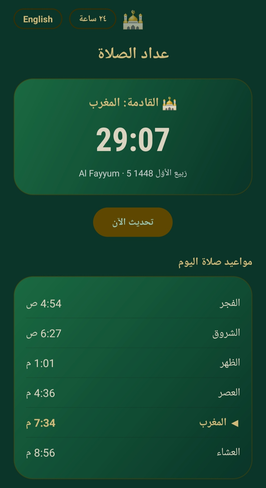
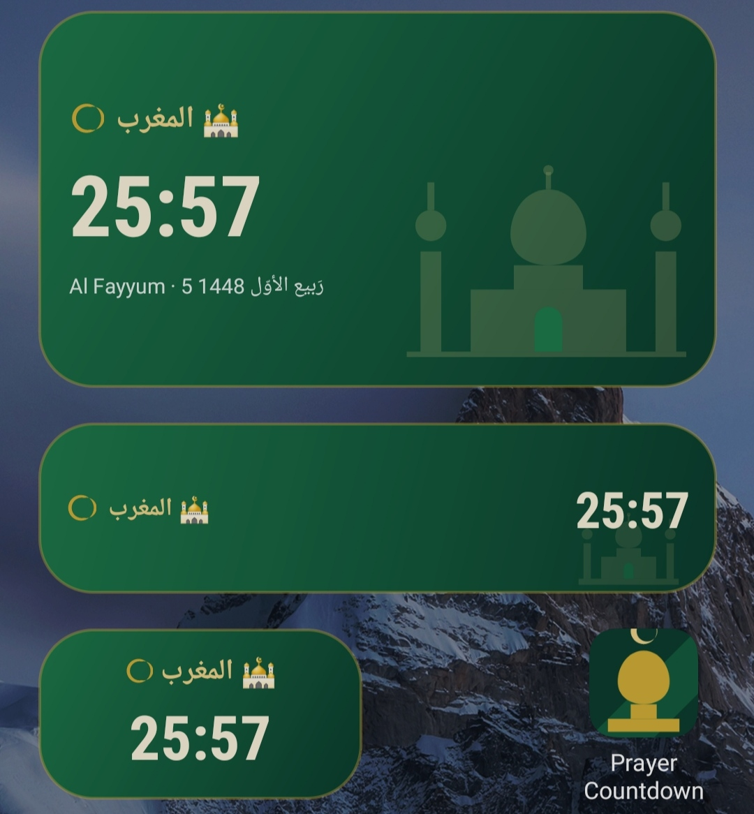
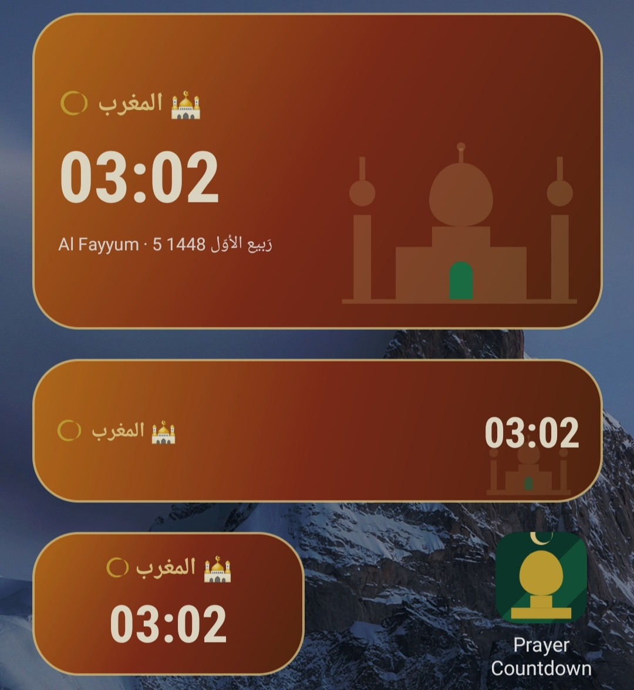
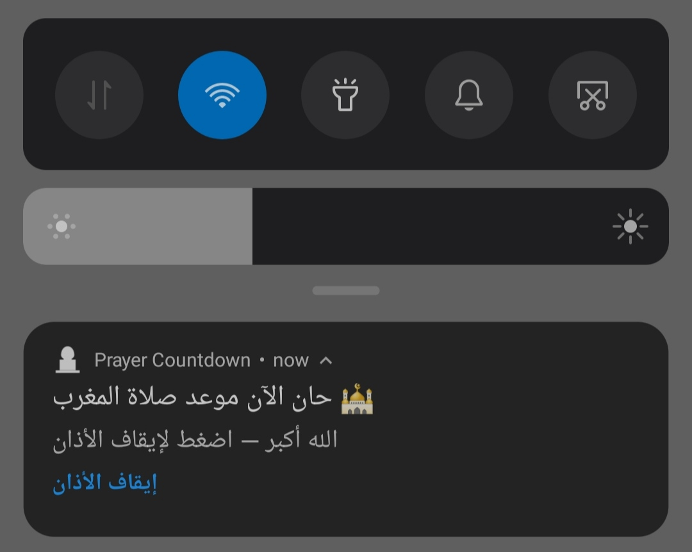

<div align="center">


### *A home-screen widget that counts down to the next prayer — accurate location, full azan, zero setup.*

[](https://kotlinlang.org/)
[](https://developer.android.com/)
[](../LICENSE)
[](https://github.com/diea-abdeltwab)

[](https://git.io/typing-svg)



</div>

---

## 🕋 About

**Prayer Countdown** (عداد الصلاة) is the Android sibling of [praybar](../linux/README.md) — a home-screen widget plus companion app that shows a live countdown to the next prayer, wherever you are.

It auto-detects your location and country, resolves the right calculation method for that country automatically (not just Egypt), and can ring a full azan at prayer time via a scheduled alarm — even if the app itself isn't open.

> 🐧 Looking for the Linux/Waybar version instead? See [`../linux/README.md`](../linux/README.md).

---

## 📸 Preview

<div align="center">

| Home screen widgets | Normal state | Approaching (imminent) | Azan notification |
|:---:|:---:|:---:|:---:|
|  |  |  |  |
| All 3 sizes side by side | Full app screen + today's schedule | Widget shifts to a warm gradient as the prayer nears | Notification with a one-tap stop action |

</div>

---

## ✨ Features

- 🏠 **Home-screen widgets in 3 sizes** — large (full schedule), small (single line), and square (2×1)
- 🌍 **Automatic location + country-aware calculation** — resolves the right authority (Egyptian GAS, Umm Al-Qura, ISNA, Diyanet, and more) based on your detected country, defaulting to the Muslim World League method anywhere else
- 🔔 **Scheduled azan alarms** — one exact alarm per remaining prayer today, armed via `AlarmManager` so it rings even if the app is closed or the phone is dozing
- 🔁 **Survives reboots** — a boot receiver re-arms today's remaining alarms automatically
- 🌐 **Bilingual** — Arabic and English, switchable in-app
- 🕐 **12h/24h toggle** — switch the display format instantly, no reload
- 🟠 **Visual urgency state** — the widget's background shifts as a prayer gets close
- 📴 **Works from cache** — shows the last successfully fetched schedule if you open it offline

---

## 📲 Installation (APK)

The prebuilt APK is at [`PrayerCountdown.apk`](PrayerCountdown.apk).

```bash
adb push PrayerCountdown.apk /sdcard/Download/
# → or just copy it over via USB / cloud drive — any method that lands the file on the phone works
```

1. Copy `PrayerCountdown.apk` to your phone (USB, cloud drive, `adb push`, etc.)
2. Open it — Android will ask you to allow installs from this source once; approve it
3. Open **Prayer Countdown** once so it can fetch your location and today's schedule
4. Long-press your home screen → **Widgets** → **Prayer Countdown** → drag your preferred size onto the home screen

### Permissions used

| Permission | Why |
|---|---|
| `INTERNET` / `ACCESS_NETWORK_STATE` | Fetch prayer times and detect location |
| `RECEIVE_BOOT_COMPLETED` | Re-arm today's remaining azan alarms after a reboot |
| `SCHEDULE_EXACT_ALARM` | Ring the azan at the exact prayer time |
| `POST_NOTIFICATIONS` | Show the azan notification |
| `FOREGROUND_SERVICE` / `FOREGROUND_SERVICE_MEDIA_PLAYBACK` | Play the full azan audio reliably |
| `WAKE_LOCK` | Keep the azan playing even if the screen sleeps mid-playback |

---

## 🛠️ Building from source

This repo ships the **raw source** (`source/`) — manifest, resources, and Kotlin files — rather than a full Gradle project, so you'll wrap it in a fresh Android Studio project:

1. In Android Studio: **New Project → Empty Views Activity**
   - Package name: `com.prayer.countdown`
   - Language: Kotlin · Minimum SDK: 23
2. Replace the generated `AndroidManifest.xml`, `res/`, and `src/` (as `java/com/prayer/countdown/` — Android Studio will want `.kt` files there) with the ones from [`source/`](source/)
3. Copy [`source/debug.keystore`](source/debug.keystore) into your project root if you want matching debug-signature builds
4. Sync Gradle, then **Build → Build Bundle(s)/APK(s) → Build APK(s)**

```text
android/
├── PrayerCountdown.apk
├── screenshots/                  # README preview images
└── source/
    ├── AndroidManifest.xml
    ├── debug.keystore
    ├── res/            # layouts, drawables, strings (ar + en)
    └── src/            # Kotlin source (17 files)
```

<details>
<summary><b>Source layout — what each file does</b></summary>

| File | Responsibility |
|---|---|
| `PrayerRepository.kt` | Fetches + caches prayer times (Aladhan API), resolves location |
| `MethodResolver.kt` | Maps country code → calculation method + Asr school |
| `PrayerLogic.kt` / `Prayer.kt` | Core prayer-time / countdown logic |
| `AzanScheduler.kt` / `AzanAlarmReceiver.kt` / `AzanService.kt` | Schedules and plays the azan |
| `BootReceiver.kt` | Re-arms alarms after device restart |
| `PrayerWidgetProvider{Large,Small,Square}.kt` | The three widget sizes |
| `WidgetRenderer.kt` | Shared widget rendering logic |
| `MainActivity.kt` | Standalone app screen (today's full schedule) |
| `LocaleHelper.kt` / `TimeFormatHelper.kt` | Language and 12h/24h toggling |

</details>

---

## 🌍 Calculation method by country

Resolved automatically from your detected country code — a few examples:

| Country | Method |
|---|---|
| 🇪🇬 Egypt | Egyptian General Authority of Survey |
| 🇸🇦 Saudi Arabia | Umm Al-Qura |
| 🇦🇪 🇧🇭 🇴🇲 Gulf | Gulf Region |
| 🇰🇼 Kuwait | Kuwait |
| 🇶🇦 Qatar | Qatar |
| 🇵🇰 🇮🇳 🇧🇩 🇦🇫 South Asia | Karachi (Hanafi Asr) |
| 🇺🇸 🇨🇦 North America | ISNA |
| 🇹🇷 Turkey | Diyanet |
| 🇮🇷 Iran | Tehran |
| Anywhere else | Muslim World League *(global default)* |

---

## 📜 License

Released under the [MIT License](../LICENSE) (applies to the whole `praybar` project, including the [Linux/Waybar version](../linux/README.md)).

---

<div align="center">

### 🤝 Built by [Diea Abdeltwab](https://github.com/diea-abdeltwab)

[](https://www.linkedin.com/in/diea-abdeltwab/)
[](https://github.com/diea-abdeltwab)

⭐ **If this keeps you on time for prayer, consider starring the repo!** ⭐


</div>
