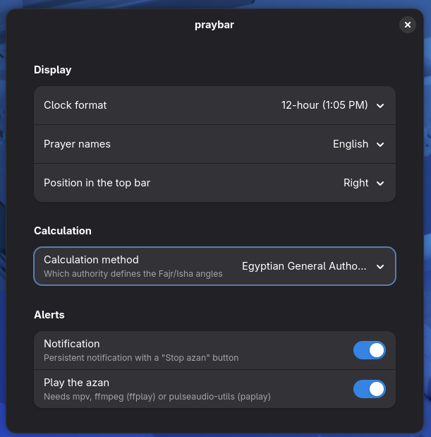

<div align="center">


### *A native GNOME Shell extension — countdown next to the clock, no drift, no setup.*

[](https://extensions.gnome.org/)
[](https://gjs.guide/)
[](https://www.python.org/)
[](../LICENSE)
[](https://github.com/diea-abdeltwab)

[](https://git.io/typing-svg)

</div>

---

## 🕋 About

**praybar for GNOME** is a lightweight [GNOME Shell extension](https://gjs.guide/extensions/) that shows a live countdown to the next prayer **right next to the clock** — with a dropdown for the full daily schedule, a persistent notification with a **Stop azan** button, and azan playback when the time comes.

> 🧩 Looking for another platform? See the [Waybar version](../linux/README.md), the [Omarchy 4 version](../omarchy-quatto/README.md) or the [Android version](../android/README.md).

It detects your location by itself, calculates timings via the [Aladhan API](https://aladhan.com/prayer-times-api), and caches them sensibly, so it stays fast, quiet on your network and — most importantly — **stable**. Every night at 00:00 it fetches the new day's timings **and re-detects where you are**, so travelling to another city just works.

<div align="center">

| ⏱️ Live Countdown | 🔔 Notification + Azan | 🧭 Auto Location | 🕌 Full Schedule |
|:---:|:---:|:---:|:---:|
| Next to the clock: `🕌 Maghrib 25m --` | Fires once per prayer, with *Stop azan* | Detected every night at 00:00 | Fajr → Isha, next prayer highlighted |

</div>

---

## 📸 Preview

<div align="center">

| Top bar + schedule | Azan notification | Preferences |
|:---:|:---:|:---:|
|  |  |  |
| Countdown + dropdown with the whole day | Persistent, with a one-click *Stop azan* | Native libadwaita window |

</div>

The text turns **amber** under 15 minutes and **red and blinking** under 5 — the same urgency colours as the Waybar version. (Blinking is skipped when GNOME animations are turned off.)

---

## ✨ Features

- 🧭 **Fully automatic location** — no coordinates to enter, no built-in default city. It uses **GNOME's own location service (GeoClue)** first, which is much closer than an IP lookup, and is re-detected **every night at 00:00** together with the new day's timings
- 🎯 **Jitter-tolerant** — a new reading within ~5 km of the last one is treated as "same place", so timings never shift for no reason; a weaker lookup never overrides a stronger one
- 🔔 **Native notification + azan** — fires once per prayer (de-duplicated across reloads), with a **Stop azan** button
- 🎨 **Color-coded urgency** — amber → red + blinking as the prayer approaches
- 🕌 **Dropdown schedule** — Fajr → Isha with the next prayer highlighted, *Refresh now*, *Stop azan*, *Settings*
- ⚙️ **Native preferences** — calculation method, 12/24-hour clock, English/Arabic prayer names, position in the bar
- 📴 **Works offline** — keeps showing the last cached day (flagged "offline") and retries every minute
- 🗑️ **Clean uninstall** — one script removes the extension, its settings and its caches

---

## 📦 Installation

### Prerequisites

| Requirement | Purpose |
|---|---|
| GNOME Shell 45 – 50 | Fedora 39+, Ubuntu 23.10+, Arch, … (Wayland or X11) |
| `python3` | Location + prayer-time backend |
| `glib-compile-schemas` | Compiles the settings schema (normally already installed) |
| GeoClue demo tool `where-am-i` *(recommended)* | Accurate location. **`install.sh` offers to install it for you** (`geoclue2-demos` on Fedora, `geoclue-2-demo` on Debian/Ubuntu) |
| `notify-send` (libnotify ≥ 0.8) *(optional)* | Notification with the **Stop azan** button |
| `mpv` *(or `ffplay` / `paplay` / `pw-play`)* *(optional)* | Azan playback |

### Steps

```bash
git clone https://github.com/diea-abdeltwab/praybar-countdown.git
cd praybar-countdown/gnome
chmod +x install.sh
./install.sh
```

The installer will:

1. ✅ Check dependencies, and offer to install the GeoClue tool if it is missing (it asks before running `sudo`)
2. 📁 Copy the extension to `~/.local/share/gnome-shell/extensions/`
3. ⚙️ Compile the GSettings schema
4. 🧪 Test the backend and show the location it detected and **where it came from** (`via geoclue` is what you want)
5. 🔌 Enable the extension

> 📍 **Turn on Location Services** once: *Settings → Privacy & Security → Location Services*. Without it GeoClue stays silent and praybar falls back to an IP lookup.

> **Wayland (Fedora's default):** GNOME only discovers new extensions at login. **Log out and back in once**, then run  
> `gnome-extensions enable praybar@diea-abdeltwab.github.io`  
> On X11 press `Alt+F2`, type `r`, press Enter.

---

## 🗑️ Uninstall

```bash
./uninstall.sh
# → disables the extension, removes its files, settings (dconf) and caches
```

---

## ⚙️ Configuration

Open the preferences with **Settings** in the dropdown, or:

```bash
gnome-extensions prefs praybar@diea-abdeltwab.github.io
```

| Setting | Options | Default |
|---|---|---|
| Clock format | 24-hour / 12-hour | 24-hour |
| Prayer names | English / العربية | English |
| Position in the top bar | **Next to the clock** / Right / Left | Next to the clock |
| Calculation method | 11 authorities (Aladhan ids) | **5 — Egyptian General Authority of Survey** |
| Notification / Play the azan | on / off | on |

<details>
<summary><b>Change settings from the terminal (gsettings)</b></summary>

```bash
SCHEMA_DIR=~/.local/share/gnome-shell/extensions/praybar@diea-abdeltwab.github.io/schemas
gsettings --schemadir "$SCHEMA_DIR" set org.gnome.shell.extensions.praybar calc-method 5
gsettings --schemadir "$SCHEMA_DIR" set org.gnome.shell.extensions.praybar time-format '12h'
gsettings --schemadir "$SCHEMA_DIR" set org.gnome.shell.extensions.praybar prayer-names 'ar'
```

</details>

<details>
<summary><b>Where the countdown goes</b></summary>

Next to the clock the text is followed by ` --` (`🕌 Maghrib 25m --   Oct 4  11:38 PM`), exactly like the Waybar versions. If you move it to the left or right of the bar the separator is dropped.

</details>

---

## 🧠 How it works

```text
Extension (GJS, inside gnome-shell)               Backend (python3, short-lived)
  extension.js  ── spawns at most hourly ───────►  praybar_backend.py
   UI · timers · notification · azan   ◄─ JSON ──   location + Aladhan + cache
  prayerLogic.js  (pure functions, unit-tested)
```

| Layer | Refresh trigger | Why |
|---|---|---|
| **Location** | Once per calendar day — the first run after 00:00 | Re-detects where you are every night. Order: **GeoClue** → wttr.in → generic IP lookups |
| **Confidence guard** | Whenever a *different* location comes back | A weaker lookup (IP) disagreeing with a stronger one (GeoClue) is treated as a one-off failure, not as you having moved |
| **Jitter filter** | Ignores changes < ~5 km | Stops IP noise from being mistaken for travel |
| **Timings cache** | Per day, per location + calculation method | Prayer times stay stable; changing the method applies immediately |
| **Tomorrow's Fajr** | Fetched together with today | The countdown after Isha is exact, not an approximation |
| **If every lookup fails** | — | The last known location is kept; with no history at all you see an error instead of times for a guessed city |

<details>
<summary><b>Why a separate backend process?</b></summary>

A blocking network call inside the compositor process freezes the whole desktop, and a crash there takes the shell with it. A short-lived child process isolates both. The countdown itself is plain date arithmetic done in JavaScript, so the backend only needs to run about once an hour (and at midnight).

</details>

<details>
<summary><b>Why does the notification use <code>notify-send</code>?</b></summary>

The shell's internal `MessageTray` classes changed their constructors between GNOME 45 and 46+. A standard freedesktop notification (with an action button) behaves the same on every supported version, so there is one code path instead of several. If `notify-send` is missing, praybar falls back to a plain shell notification without the button.

</details>

---

## 🩺 Troubleshooting

<details>
<summary><strong>The extension isn't listed after installing</strong></summary>
<br>

On Wayland GNOME only discovers new extensions at login. Log out and back in, then `gnome-extensions enable praybar@diea-abdeltwab.github.io`.

</details>

<details>
<summary><strong>After updating, the bar still shows the old behaviour or an error like "GSettings key … not found"</strong></summary>
<br>

GNOME Shell loads an extension's code once, at login, and keeps running that copy even after you replace the files. After re-running `./install.sh` (or `./uninstall.sh` + `./install.sh`) **log out and back in**. You can confirm the new version is loaded with `gnome-extensions info praybar@diea-abdeltwab.github.io` — the description should match the one in `metadata.json`.

</details>

<details>
<summary><strong>The bar shows <code>🕌 –</code></strong></summary>
<br>

Open the dropdown — it shows the reason (usually "could not detect your location" or no internet). praybar retries every minute and recovers by itself.

</details>

<details>
<summary><strong>Times look slightly off, or the city is a big one near me</strong></summary>
<br>

That is what an **IP lookup** does: it only knows your ISP's registered city. Check the source the installer printed (`via geoclue` / `wttr` / `ip`). If it is not `geoclue`:

1. Install the tool: `sudo dnf install geoclue2-demos` (Fedora) or `sudo apt install geoclue-2-demo` (Debian/Ubuntu).
2. Turn on *Settings → Privacy & Security → Location Services*.
3. Check what GeoClue itself reports: `/usr/libexec/geoclue-2.0/demos/where-am-i -t 15`.
4. Delete the cache so it re-detects now: `rm ~/.cache/praybar/location.json`, then *Refresh now* in the dropdown.

GeoClue's Wi-Fi data comes from [BeaconDB](https://beacondb.net/), which is crowd-sourced, so accuracy varies by region; where it has no data GeoClue falls back to a GeoIP answer (usually city-level, ≈ 25 km).

</details>

<details>
<summary><strong>No azan sound plays</strong></summary>
<br>

Install a player: `sudo dnf install mpv` (Fedora) / `sudo apt install mpv` (Debian/Ubuntu). The first ~second can be swallowed while the sound card wakes up, so praybar adds a short silence before the azan.

</details>

<details>
<summary><strong>No "Stop azan" button on the notification</strong></summary>
<br>

It needs `notify-send` from libnotify ≥ 0.8. You can also stop the azan from the dropdown.

</details>

<details>
<summary><strong>Something else is wrong</strong></summary>
<br>

Watch the shell's log while reproducing it:

```bash
journalctl -f -o cat /usr/bin/gnome-shell
```

</details>

---

## 🏗️ Project Structure

```text
gnome/
├── install.sh / uninstall.sh
├── screenshots/
├── tests/
│   ├── prayerLogic.test.mjs        # node --test
│   └── test_backend.py             # python3 -m unittest
└── praybar@diea-abdeltwab.github.io/
    ├── metadata.json
    ├── extension.js                # UI, timers, notification, azan
    ├── prefs.js                    # libadwaita preferences
    ├── prayerLogic.js              # pure logic (no GNOME imports)
    ├── stylesheet.css
    ├── schemas/                    # GSettings schema
    ├── backend/praybar_backend.py  # location + Aladhan + cache
    └── assets/azan.mp3
```

### Development

```bash
node --experimental-default-type=module --test tests/prayerLogic.test.mjs
python3 -m unittest tests/test_backend.py
gnome-extensions prefs praybar@diea-abdeltwab.github.io
# nested sandbox (no logout): dbus-run-session -- gnome-shell --nested --wayland
# (GNOME 49+: `--devkit` instead of `--nested`)
```

---

## 🔐 Security & reliability

- The backend talks HTTPS to `api.aladhan.com`, `wttr.in` and `ipapi.co`. The last-resort lookup (`ip-api.com`) is plain HTTP, so a network attacker could spoof the *location* (never the code).
- Your IP address is sent to those providers for detection. With Location Services on, **GeoClue** may also send nearby Wi-Fi access-point identifiers to its geolocation provider (BeaconDB by default) — that is GNOME's standard behaviour, controlled by *Privacy → Location Services*.
- Once a fix comes from GeoClue, its coordinates are sent to OpenStreetMap's Nominatim to get a city name for the dropdown title (once a day).
- Child processes (backend, audio player, `notify-send`) are tracked and killed when the extension is disabled; every timer and signal is removed.
- Cache files are written atomically, so a crash never leaves a half-written file.

---

## 🔮 Future improvements

- Talk to GeoClue over D-Bus directly instead of via the `where-am-i` tool (no extra package)
- Re-detect the location on network change, not only at midnight
- Per-prayer toggles, pre-prayer reminder, Friday (Jumu'ah) handling
- Hijri date and Qibla direction in the dropdown
- Offline calculation so no API is needed
- Publish on extensions.gnome.org

---

## 📜 License

Released under the [MIT License](../LICENSE).

---

<div align="center">

### 🤝 Built by [Diea Abdeltwab](https://github.com/diea-abdeltwab)

[](https://www.linkedin.com/in/diea-abdeltwab/)
[](https://github.com/diea-abdeltwab)


</div>
